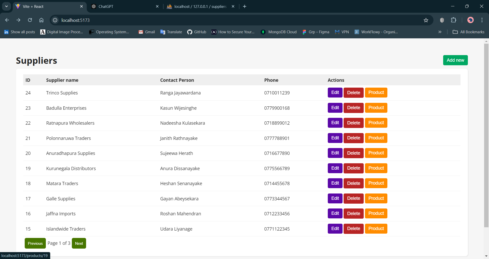
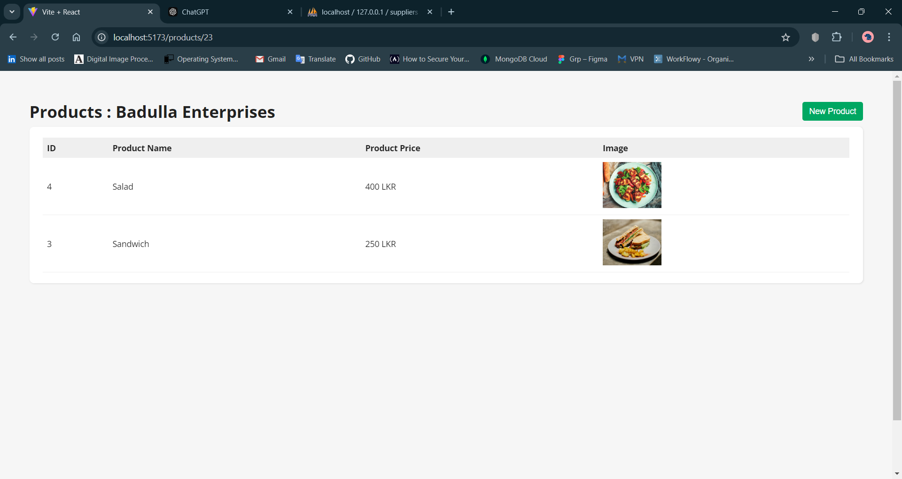
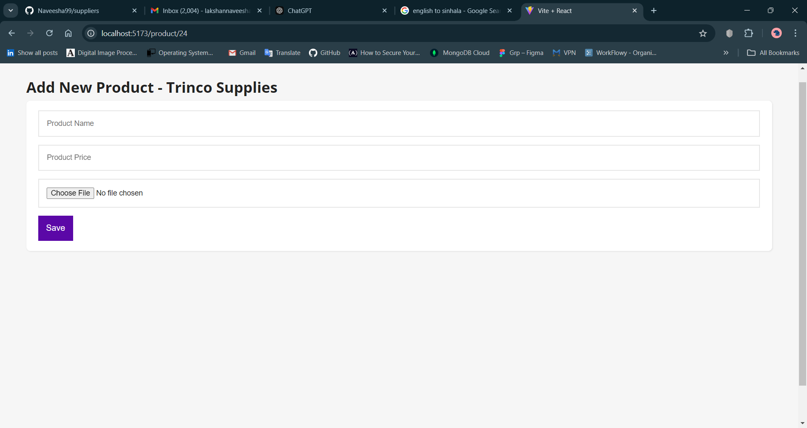

# Supplier Products System

## Overview

The Supplier Products System allows users to manage supplier information and associated products. Users can add suppliers, their contact details. Also select supplier and add products for that supplier.

## Technologies Used

- **Backend:** Laravel
  - Migrations
  - Seeders
  - Validation

- **Frontend:** React.JS

## Features

1. **Add Supplier Details Form:**
   - Fields for Supplier Name, Contact Person, Mobile Numbers.

2. **Add products for each supplier:**
   - Select supplier and add product for that particular supplier.(Product Name, Price, Image)

3. **REST API Endpoints:**
   - Create, Update, Delete, and List suppliers.
   - Endpoint to receive supplier details along with products.

4. **Supplier Listing Page:**
   - Lists suppliers with pagination (maximum of 10 suppliers per page).
   - Global search box to filter suppliers by names and mobile numbers.

5. **Product Listing Page for particular Supplier:**
   - List all products for each supplier with images


### Backend Setup

1. Clone the repository:

   ```bash
   git clone https://github.com/Naveesha99/suppliers.git
   cd suppliers/Arctiq

## Screenshot





###

Only supplier ID 23 and 23 already added products